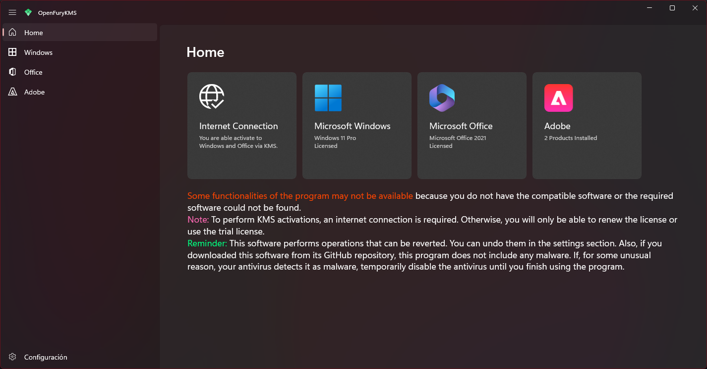

# Prometheus Forge

Originally known as *FuryKMS / OpenFuryKMS*, is an intuitive front-end that facilitates Windows and Office activation using SLMGR and OSPP commands via PowerShell. It aims to provide a secure and transparent alternative to users looking to activate their Microsoft products without risk of malware or intrusions.
This is the latest iteration of the original project, rebuilt using modern technologies with **WinUI 3**. This version focuses on activating the following products:

## Supported Products
### Windows
- All editions of Windows 10 / 11 Home
- All editions of Windows 10 / 11 Pro
- All editions of Windows 10 / 11 Education
- All editions of Windows 10 / 11 Enterprise
- Windows Server 2025 / 2022 / 2019 / 2016 Standard and Datacenter

### Microsoft Office (Click-to-Run)
- Microsoft 365
- Microsoft Office 2021
- Microsoft Office 2019
- Microsoft Office 2016
- Microsoft Office 2013

### Adobe
The application can activate most Adobe products by blocking the primary executable (e.g., `Photoshop.exe`) through the firewall. Tested on:

- Adobe Photoshop 2022
- Adobe Illustrator 2023

## Features
  - You can choose to create a task that reactivates your product every 180 days.
  - Manual reactivation is also available.
  - Option to use a trial license.
  - Remove the current license key to reset the activation state.
  - View detailed license information for active products.
  - Automatic detection of KMS servers.
  - Restore default activation settings for products.

## Roadmap
### Planned Features:
- Multi-language support.
- Improved theme-switching logic for the application.
- Code optimization and performance improvements.
- Support for non-Click-to-Run editions of Microsoft Office.
- Expanded support for additional Adobe products.
- Enhanced UI/UX design.
- Ability for users to input their own KMS server and add a custom license (if feasible).
- Option to permanently activate the system (if feasible).

### Legacy Version:
Support for older operating systems and remaining products will be provided in a separate legacy version after implementing the most critical features in the current iteration.

## Notes
- **Internet Requirement:** A stable internet connection is necessary for activation.
- **Antivirus Warnings:** In rare cases, antivirus software may flag this program as malware. This is a false positive. If you encounter such an issue, disable your antivirus temporarily while using the program.
- **Development Notes:**
  - I am new to working with **WinUI 3**, and previous iterations of this program were built using **WinForms**.
  - The current version has a Core Project. I am seeking advice or clarification on whether it can be removed or modified to improve the project.
